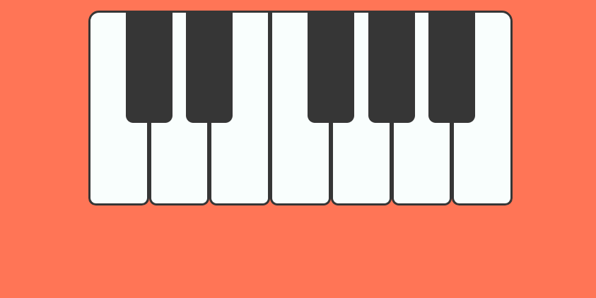

<!-- using shields.io for status buttons -->


[](https://travis-ci.com/ManuelVargas1251/Chord-Finder)
[](https://coveralls.io/github/ManuelVargas1251/Chord-Finder?branch=enhancement%2Fcoverage)
[](https://github.com/facebook/jest)

# Chord Finder 🎹

This is a js web application that tells you what chord you are playing on the piano in any inversion. Click or keypress the notes to build your chord! If you select two notes it will tell you what the interval is between those two notes. 

I started by rewriting my previous C++ chord finder [console application](https://github.com/ManuelVargas1251/ChordFinder) in javascript and added the web interface as I went.

[[View Web Application](https://mnl.space/Chord-Finder/)]



## Console Usage
You can use the [Chrome Console](https://developers.google.com/web/tools/chrome-devtools/console/) to use the functions directly or use them in your own project.

To find a chord name, use the `updateChord()` function and pass in an array with the notes you want. 

```javascript
updateChord(["A", "C#", "E", "G#"])	//  A Major 7
```

## Unit Testing & Coverage

Using [Facebook's Jest](https://facebook.github.io/jest/) for unit testing. Configured [Travis-CI](https://travis-ci.com/) for continuos integration on every commit and pull request as well as coverage reporting from [Coveralls](https://coveralls.io/)

Install the npm modules to test
```npm
npm install
npm test
```
## Environments
By using rawgit.com links I was able to get working lower environments to test code in any committed branch. I was also able to provide test statuses for every branch through Travis CI and Coveralls. I may add more branches to this list when they become important.


[Production](https://mnl.space/Chord-Finder/)

[](https://travis-ci.com/ManuelVargas1251/Chord-Finder)
[](https://coveralls.io/github/ManuelVargas1251/Chord-Finder?branch=master)

[Development](https://cdn.rawgit.com/ManuelVargas1251/Chord-Finder/development/index.html)

[](https://travis-ci.com/ManuelVargas1251/Chord-Finder)
[](https://coveralls.io/github/ManuelVargas1251/Chord-Finder?branch=development)

[Enhancement/Coverage](https://cdn.rawgit.com/ManuelVargas1251/Chord-Finder/enhancement/coverage/index.html)

[](https://travis-ci.com/ManuelVargas1251/Chord-Finder)
[](https://coveralls.io/github/ManuelVargas1251/Chord-Finder?branch=enhancement%2Fcoverage)

# Reference

[Musical Chord Wiki](https://en.wikipedia.org/wiki/Chord_(music))

[Musical Interval Wiki](https://en.wikipedia.org/wiki/Interval_(music))

